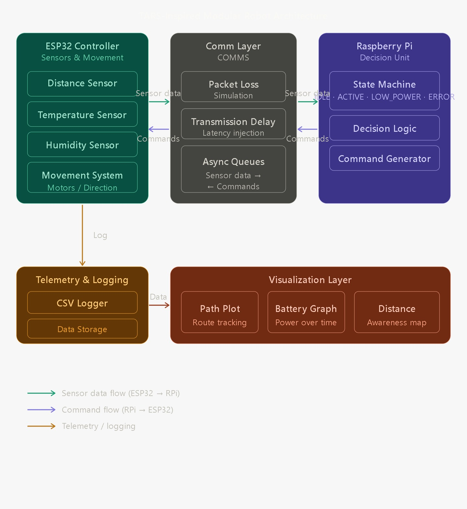
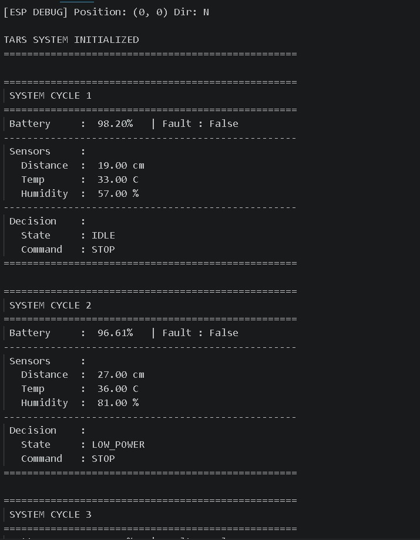
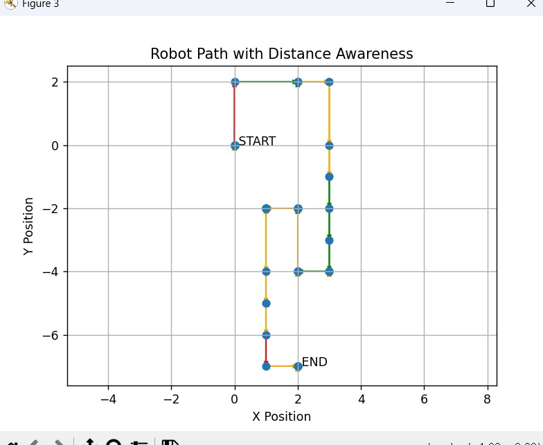

# TARS Autonomous System

An intelligent, modular, and voice-controlled autonomous robotics platform inspired by *Interstellar*. The TARS system integrates hardware control (ESP32/Raspberry Pi), real-time sensor telemetry, a centralized command orchestrator, interactive PyGame simulation, and a web-based dashboard into a single cohesive ecosystem.

---

## 📸 System Overview

| Block Diagram | Terminal Orchestrator |
| :---: | :---: |
|  |  |

| Trajectory Navigation | Telemetry Plotting |
| :---: | :---: |
|  |  |

---

## ✨ Features

- **🎙️ Voice Control**: Powered by offline Vosk voice recognition and Edge-TTS. Speak directly to TARS and have it respond dynamically while executing hardware commands.
- **🕹️ PyGame Visual Simulation**: A standalone simulated environment where TARS actively maps obstacles, fires raycasts, and routes paths dynamically with built-in collision detection.
- **🧠 Central Orchestrator**: A sophisticated command bus that seamlessly routes inputs between autonomous logic, voice commands, and manual controls.
- **🌐 Web Dashboard**: A Flask-based backend server providing an interface to interact with or monitor the robot over a local network.
- **📊 Real-time Telemetry**: Data logging and plotting systems utilizing Matplotlib for visual tracking of battery draw, movement trajectory, and sensor inputs over time.
- **🧱 Modular Architecture**: A fully decoupled architecture cleanly separating `core`, `voice`, `hardware`, `telemetry`, and `simulation` subsystems.

---

## 🏗️ Architecture & Structure

```text
TARS-Autonomous-System/
├── assets/
│   └── vosk-model-small-en-us-0.15/    # Offline speech recognition model
├── core/
│   ├── command_bus.py                  # Cross-system command routing
│   ├── movement.py                     # Kinematics and coordinate tracking
│   ├── robot_core.py                   # Central logic node
│   └── state.py                        # Shared global state dictionary
├── dashboard/
│   ├── index.html                      # Web frontend
│   ├── server.py                       # Flask application
│   └── static/                         # Web assets & TTS output buffer
├── hardware/
│   ├── comms.py                        # Network bridges (Pi <-> ESP32)
│   ├── control.py                      # Low-level hardware state machine
│   ├── esp32_controller.py             # Microcontroller logic
│   ├── pi_controller.py                # SBC logic
│   └── sensors.py                      # Virtualized sensor payloads
├── simulation/
│   └── visual_sim.py                   # Interactive 2D PyGame environment
├── telemetry/
│   ├── logger.py                       # CSV data writer
│   └── plot.py                         # Matplotlib telemetry generation
├── tests/                              # Subsystem unit tests
├── main.py                             # The primary Terminal Orchestrator
└── launch_tars.bat                     # 1-Click Startup Script
```

---

## 🚀 Getting Started

### Prerequisites
- **Python 3.10+** (Tested on Python 3.14)
- A virtual environment is highly recommended.

### Installation
1. Clone the repository to your local machine.
2. Initialize your virtual environment:
   ```bash
   python -m venv .venv
   .\.venv\Scripts\activate
   ```
3. Install the required dependencies:
   ```bash
   pip install pygame-ce flask edge-tts vosk sounddevice matplotlib
   ```

### Running the System
The easiest way to launch the entire ecosystem is using the provided batch script.

Simply double-click **`launch_tars.bat`** or run it from your terminal:
```powershell
.\launch_tars.bat
```

This script will automatically:
1. Launch the **Flask Dashboard Server** and open your web browser.
2. Launch the **PyGame Visual Simulation** in a dedicated window.
3. Launch the **Central Orchestrator** in a dedicated terminal window so you can interact with the voice AI.

> **Note on Audio Overlap:** The `main.py` orchestrator and the `visual_sim.py` simulation both possess voice interaction capabilities. If you run them simultaneously, they will both respond to your microphone. Simply close the PyGame window or stop the terminal process if you wish to use only one interface.

---

## 🛠️ Diagnostics & Validation

The repository includes a suite of independent modules. You can run subsystem tests to ensure local components are functional:
- Verify Telemetry Plotting: `python telemetry/plot.py`
- Run Voice Tests: `python tests/test_voice.py`
